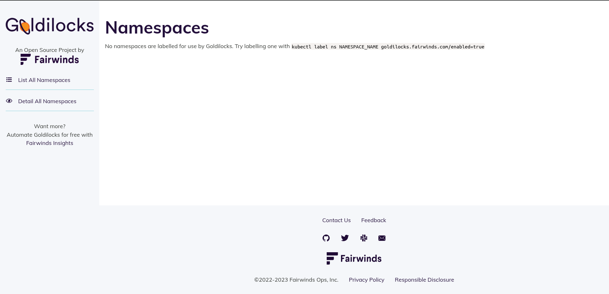
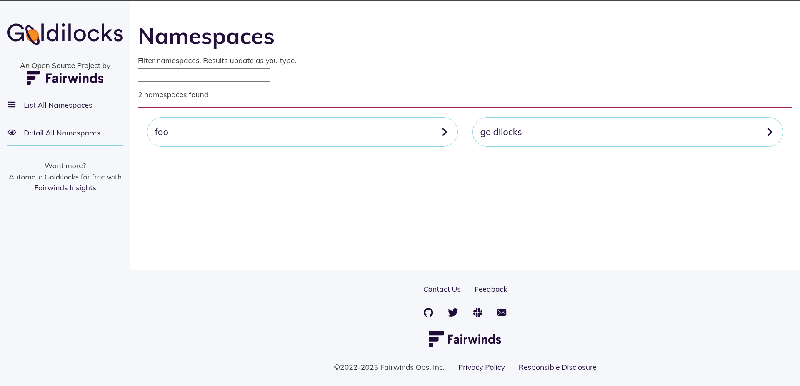
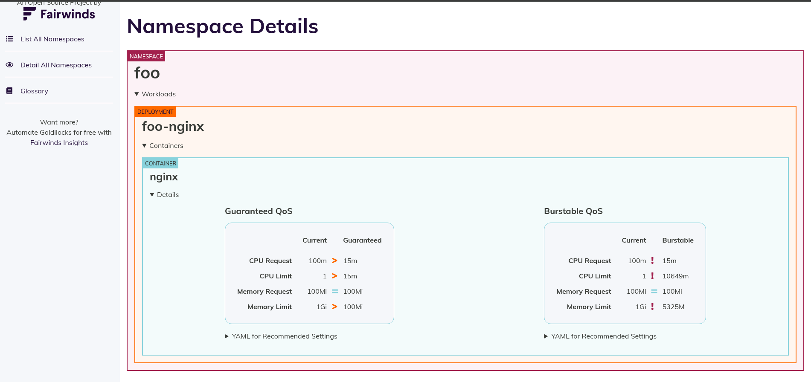
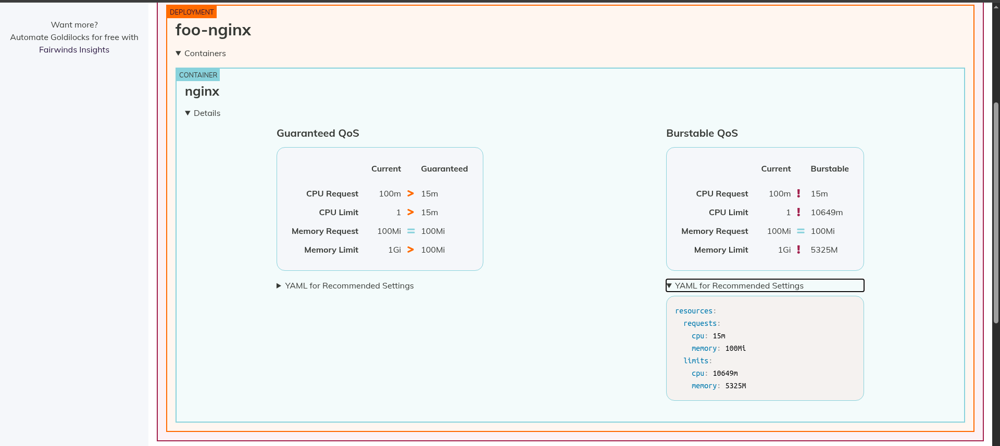
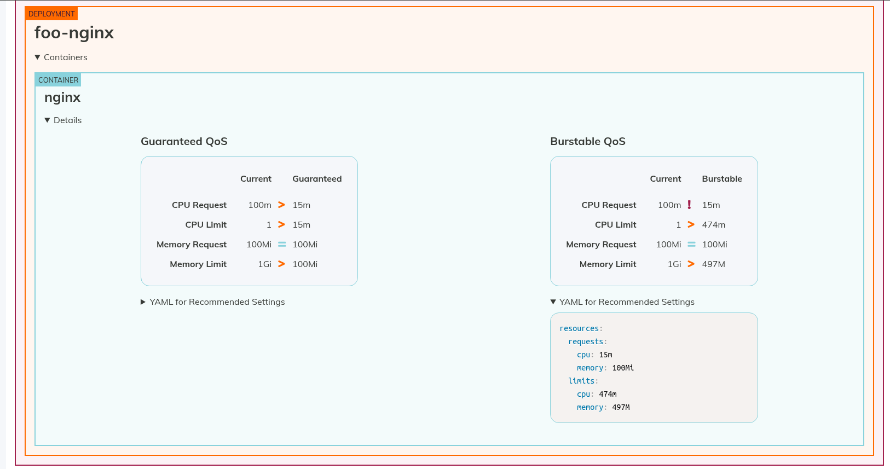

# Right-sizing your Kubernetes Infrastructure: Balancing Performance and Cost

Do you know what is **Goldilocks**? If not, you are in the right place for learn what is it, how you can resize your Kubernetes infrastructura, optimize your coast and pay less money to cloud providers like AWS or GPC.

## What is Goldilocks

> Goldilocks is a utility that can help you identify a starting point for resource requests and limits. 

If we visit the Goldilocks website we find a lot of information, but there are more benefits about this tool. 

Imagine that we provisioned an application poorly, setting more resources than the application actually uses in its daily operations. Or imagine this: 100 microservices with misconfigured CPU and memory resources. This causes many problems:

- **Over-provisioning:** Wasting money on unused resources.
- **Under-provisioning:** Risking application crashes or performance issues.
- **Incresing coasts:** Remenber, in Cloud we pay for what we provision.

Without Goldilocks, we deploy our applications and don't have a simple way to look at them and say, "Ok, this application is optimized."

## How Goldilocks and VPA Work Together

Goldilocks works alongside the Vertical Pod Autoscaler (VPA). It creates a VPA in "recommendation mode" for your workloads (Deployment, StatefulSet, or DaemonSet). This means it watches how much CPU and memory your pods are actually using and provides a dashboard with data-driven recommendations, without automatically changing your manifests.

## Instalation Guide

You can find the Helm Repositories on Artifact Hub:

- [VPA Helm Chart](https://artifacthub.io/packages/helm/fairwinds-stable/vpa)

- [Goldilocks Helm Chart](https://artifacthub.io/packages/helm/fairwinds-stable/goldilocks)

### Configuration VPA

For the instalations of the VPA I will only set up the recommendrer component [values.yaml](./vpa/values.yaml).


```bash
helm install vpa . -f values.yaml --namespace goldilocks
```

```text
NAME: vpa
LAST DEPLOYED: Sat Apr 25 14:59:25 2026
NAMESPACE: goldilocks
STATUS: deployed
REVISION: 1
DESCRIPTION: Install complete
NOTES:
Congratulations on installing the Vertical Pod Autoscaler!

Components Installed:
  - recommender

To verify functionality, you can try running 'helm -n goldilocks test vpa'
```

### Configurarion Goldilocks

Here is the [values.yaml](./goldilocks/values.yaml) for Goldilocks. To install it, run:

```bash
helm install goldilocks . -f values.yaml --namespace goldilocks
```

```txt
NAME: goldilocks
LAST DEPLOYED: Sat Apr 25 15:02:58 2026
NAMESPACE: goldilocks
STATUS: deployed
REVISION: 1
DESCRIPTION: Install complete
TEST SUITE: None
NOTES:
1. Get the application URL by running these commands:
  kubectl -n goldilocks port-forward svc/goldilocks-dashboard 8080:80
  echo "Visit http://127.0.0.1:8080 to use your application"
```

Now we can visit the dashboard using the port-forward command:

```bash
kubectl -n goldilocks port-forward svc/goldilocks-dashboard 8080:80
```



Ok, now we need to set the label on the select namespaces that we can monitoring the resources. For this use the command:

```bash
for ns in foo goldilocks ; do kubectl label ns $ns goldilocks.fairwinds.com/enabled=true; done
```

### Goldilocks Dashboard

Now we can see that two namespaces in the dashboard:




Now, let's click in **foo** to see the Namespace Details:



If we analyze the Burstable QoS values, Goldilocks suggests that we can resize our application to:



Goldilocks now surger that we can resize own application for 
```yaml
resources:
  requests:
    cpu: 15m
    memory: 100Mi
  limits:
    cpu: 10649m
    memory: 5325M
```

> Note: The longer you let Goldilocks and VPA analyze your application, the better and more accurate the resource recommendations will be.

### Logs Analysis

Checking the logs of the **goldilocks-controller** pod, we can see exactly what happens when we label a namespace:

```bash
kubectl logs deployment/goldilocks-controller -n goldilocks -f

I0425 18:15:09.300126       1 vpa.go:278] There are 0 vpas in Namespace/foo
I0425 18:15:09.300222       1 vpa.go:103] Namespace/foo is not managed, cleaning up VPAs if they exist...
I0425 18:15:27.011214       1 namespace.go:39] Namespace goldilocks updated. Check the labels.
I0425 18:15:27.019423       1 vpa.go:278] There are 0 vpas in Namespace/goldilocks
I0425 18:15:27.193996       1 vpa.go:191] Reconciling Namespace/goldilocks for Deployment/goldilocks-dashboard with VPA/none
I0425 18:15:27.212971       1 vpa.go:311] Created VPA/goldilocks-goldilocks-dashboard in Namespace/goldilocks
I0425 18:15:27.213019       1 vpa.go:191] Reconciling Namespace/goldilocks for Deployment/vpa-recommender with VPA/none
I0425 18:15:27.223302       1 vpa.go:311] Created VPA/goldilocks-vpa-recommender in Namespace/goldilocks
I0425 18:15:27.223367       1 vpa.go:191] Reconciling Namespace/goldilocks for Deployment/goldilocks-controller with VPA/none
I0425 18:15:27.229429       1 vpa.go:311] Created VPA/goldilocks-goldilocks-controller in Namespace/goldilocks
I0425 18:15:50.493599       1 namespace.go:39] Namespace foo updated. Check the labels.
I0425 18:15:50.507160       1 vpa.go:278] There are 0 vpas in Namespace/foo
I0425 18:15:50.644718       1 vpa.go:191] Reconciling Namespace/foo for Deployment/foo-nginx with VPA/none
I0425 18:15:50.660182       1 vpa.go:311] Created VPA/goldilocks-foo-nginx in Namespace/foo
```

After setting the labels on the foo and goldilocks namespaces, the goldilocks-controller creates 4 VPAs in "Off" mode. This mode means that the VPA will only generate metrics and recommendations; it will not automatically restart your pods to apply changes.

The responsibilities are split like this:

- Goldilocks Controller: Acts as a watcher. For every workload (Deployment, StatefulSet, or DaemonSet) inside a labeled namespace, it automatically creates one VPA object.

- VPA Recommender: Acts as the brain. It finds the VPA objects created by Goldilocks, fetches the historical metrics for those pods, calculates the ideal resource limits, and injects the recommendations into the VPA objects.

---

Analyzing the VPA recommender logs, we can see it finding and processing the 4 VPAs:

```txt
I0425 18:17:27.619970       1 recommender.go:176] "Recommender Run"
I0425 18:17:27.620090       1 cluster_feeder.go:429] "Fetching VPAs" count=4
I0425 18:17:27.620269       1 cluster_feeder.go:439] "Using selector" selector="app.kubernetes.io/component=dashboard..."
```

Note that there are four VPAs in total, one for each deployment:

- 3 deployments in the goldilocks namespace

- 1 deployment in the foo namespace

```bash
kubectl get deploy -nfoo
NAME        READY   UP-TO-DATE   AVAILABLE   AGE
foo-nginx   10/10   10           10          16m

kubectl get deploy -ngoldilocks
NAME                    READY   UP-TO-DATE   AVAILABLE   AGE
goldilocks-controller   1/1     1            1           27m
goldilocks-dashboard    2/2     2            2           27m
vpa-recommender         1/1     1            1           31m
```

## A few Moments Later

After a while, if we check the dashboard again, we can see updated recommendations:



> The longer you leave Goldilocks monitoring your application, the better the recommendations will be.

## Automation and CI/CD Integration

All of this is great, but accessing a dashboard manually every time isn't very efficient. How can we apply DevOps practices, such as automation, to this process?

If we get all VPAs:

```bash
kubectl get vpa -A

NAMESPACE    NAME                               MODE   CPU   MEM     PROVIDED   AGE
foo          goldilocks-foo-nginx               Off    15m   100Mi   True       40m
goldilocks   goldilocks-goldilocks-controller   Off    15m   100Mi   True       40m
goldilocks   goldilocks-goldilocks-dashboard    Off    15m   100Mi   True       40m
goldilocks   goldilocks-vpa-recommender         Off    15m   100Mi   True       40m
```
We can get the values of containerRecommendations in each vpa and send this values for one pipeline in Jenkins or GitHub Actions:

```bash
kubectl get vpa goldilocks-foo-nginx -nfoo -ojson | jq '.status.recommendation'
```

```json
{
  "containerRecommendations": [
    {
      "containerName": "nginx",
      "lowerBound": {
        "cpu": "15m",
        "memory": "100Mi"
      },
      "target": {
        "cpu": "15m",
        "memory": "100Mi"
      },
      "uncappedTarget": {
        "cpu": "15m",
        "memory": "100Mi"
      },
      "upperBound": {
        "cpu": "405m",
        "memory": "423953300"
      }
    }
  ]
}
```

### CI/CD Audit Pipeline

We can create a step in your CI/CD pipeline (GitHub Actions, Jenkins, or GitLab CI) that:

1. Runs a Python or Bash script to fetch the JSON data above.

2. Compares the current resources configured in your Helm Chart or Manifest with the VPA/Goldilocks recommendations.

3. Calculates the difference. If the difference is greater than 30%, the pipeline can issue a Warning or even fail the build, forcing the developer to review the resource allocation and avoid unnecessary cloud costs.

## Example Audit Pipeline

For our test, I builded one image. Look here: [Dockefile](./audit-pipeline/.docker/Dockerfile)

I also created I helm package that use this image and build one cronJob that runs after 24H, get the values and send this for one endpoiunt
